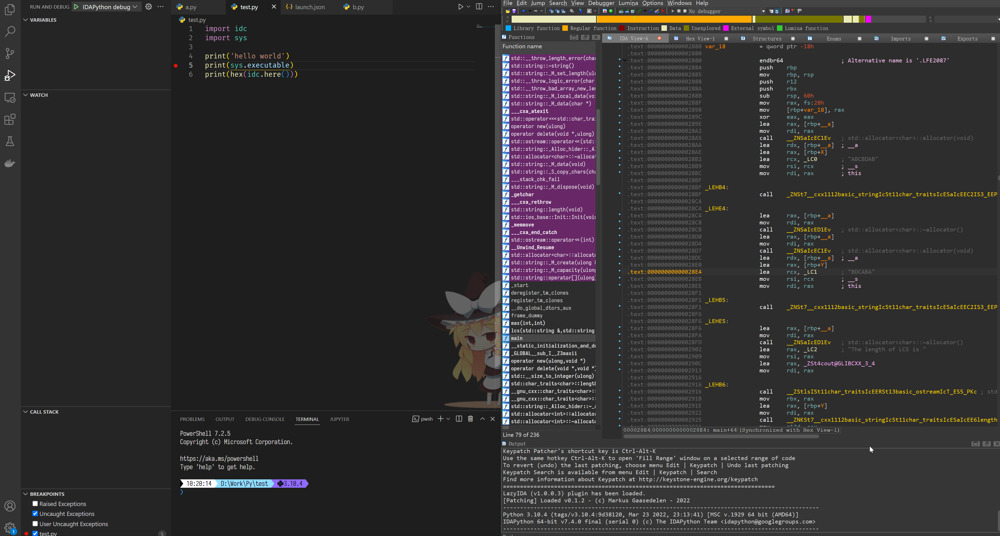

# IDAVSCode

在 VSCode 中调试 IDAPython!

参考了[idacode](https://github.com/ioncodes/idacode)

<p align="center">
  [中文]
  [<a href="doc/README-en.md">English</a>]
</p>

## Features



## Requirement


1. `python >= 3.10` # 理论上替换掉 `match case` 语句应该就可以3.x全兼容
3. `python -m pip install debugpy tornado`
2. [Python extension for VSCode](https://marketplace.visualstudio.com/items?itemName=ms-python.python)


## Install

1. 下载 IDA 插件，并解压到 Plugin 文件夹；
2. 安装 [Vscode 拓展](https://marketplace.visualstudio.com/items?itemName=Cirn09.idavscode)

## launch.json

```json
{
    "name": "IDAPython debug",
    "type": "idapython",
    "request": "launch",
    "program": "${file}",
    "host": "localhost",                                // control hostname
                                                        // 和 IDA 端一致
    "port": 5677,                                       // control port
                                                        // 和 IDA 端一致
    "timeout": 3000,                                    // 连接失败超时
    "pythonPath": "${command:python.interpreterPath}",  // python path (IDA used)
                                                        // VSCode 和 IDA 使用同版本的话就不用管这字段了
    "logFile": "",                                      // debug log file
    "debugConfig": {                                    // Python extension debug config
                                                        // 传递给 Vscode Python 拓展的调试配置
        "type": "python",
        "request": "attach",
        "justMyCode": true,
        "connect": {
            // "host": "localhost",                     // optional, default as seam as control host
                                                        // 可选，不填的话默认用上层的"host"
            "port": 5678                                // debug port
        },
        "cwd": "${workspaceFolder}"
    }
}
```

## 原理

IDA 端插件启动两个服务，一个控制服务、一个调试服务([debugpy](https://github.com/microsoft/debugpy))。

VSCode 端拓展拦截调试任务，将调试上下文信息发送到 IDA 控制服务端，IDA 控制服务负责启动调试服务，并按照上下文运行目标脚本。准备完成后，VSCode 拓展将调试任务替换为 Python Remote Attach 任务。脚本运行结束后，VSCode 拓展主动停止调试。

## 已知缺陷和待办

该插件诸多的缺陷、不如意大都因为这是一个 IDAPython 插件，它和被调试脚本运行在同一个 Python 实例下，某种意义上说它是自己调试自己。

所以解决以下以及其他潜在缺陷最好的方案是使用 C++ 重构。

- [x] `idc.ARGV`

- [x] 取消调试/连接超时

- [x] 被调试脚本触发异常后，无法正常再次调试。

    应该和IDAPython线程有关，控制和调试服务都是运行在子线程上，被调试脚本通过 `ida_kernwin.execute_sync` 运行在主线程。添加 `ida_kernwin.refresh_idaview_anyway()` 似乎就正常了。

- [ ] 对由被调试脚本 import 的模块的修改不会生效。

    https://github.com/Cirn09/idavscode/issues/1

    现在是一个不完美的解决方案。

- [ ] 调试服务无法终止：调试服务使用了 [debugpy](https://github.com/microsoft/debugpy)，debugpy 目前只提供了启动服务的接口，没有停止服务的接口 ([相关issue](https://github.com/microsoft/debugpy/issues/870))。所以调试服务启动后，debugpy会一直占用调试端口。

    暂时的解决方案：可以手动重启 IDA，或者结束 IDA 的 Python 子进程（这个子进程是debugpy启动的，IDAPython 使用 Python.dll，不会启动单独的 Python 进程）

- [x] 进行过一次调试、关闭 idb/i64、重新打开新 idb/i64 后无法正常调试（无法设置断点，stdout没有正确转发）。

    还是 debugpy 没有提供关闭接口问题的延续，关闭 idb 时 ida 会卸载插件，重开又会重新加载。

    添加 `PLUGIN_FIX` 属性，每次调试前都调用 `debugpy.debug_this_thread()` 即可解决。

- [ ] （可能存在）Python调试设置不生效：VSCode 插件拦截替换调试任务使用的是 `vscode.DebugConfigurationProvider { resolveDebugConfiguration, resolveDebugConfigurationWithSubstitutedVariables }` 两个接口，其中使用 `resolveDebugConfiguration` 补充调试配置、使用 `resolveDebugConfigurationWithSubstitutedVariables` 替换调试任务。

    实际观察，通过 `resolveDebugConfigurationWithSubstitutedVariables` 替换任务的效果和调用 `vscode.debug.startDebugging` 的效果不完全一致。抓包发现，前者创建的调试 session 少了一些选项，推测是这种方法绕过了一些 `launch.json -> session config` 流程。

- [ ] `launch.json` 中的 `pythonPath` 会被自动修正为 `python`，不确定是我这边才有的问题还是普遍存在。
- [ ] 图标
- [ ] 测试
- [ ] README-en.md
- [ ] 切分流程，提供更细粒度的命令
- [ ] 改一改是不是能做个 GDBPython 调试助手，或者是嵌入 Python 调试助手
